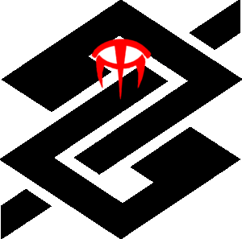

<p align="center">
  
  <h4 align="center">Spoofing Controller API</h4>
  <p align="center">
    <svg xmlns="http://www.w3.org/2000/svg" xmlns:xlink="http://www.w3.org/1999/xlink" width="112" height="20"><linearGradient id="b" x2="0" y2="100%"><stop offset="0" stop-color="#bbb" stop-opacity=".1"/><stop offset="1" stop-opacity=".1"/></linearGradient><clipPath id="a"><rect width="112" height="20" rx="3" fill="#fff"/></clipPath><g clip-path="url(#a)"><path fill="#555" d="M0 0h57v20H0z"/><path fill="#9f9f9f" d="M57 0h55v20H57z"/><path fill="url(#b)" d="M0 0h112v20H0z"/></g><g fill="#fff" text-anchor="middle" font-family="DejaVu Sans,Verdana,Geneva,sans-serif" font-size="110"> <text x="295" y="150" fill="#010101" fill-opacity=".3" transform="scale(.1)" textLength="470">platform</text><text x="295" y="140" transform="scale(.1)" textLength="470">platform</text><text x="835" y="150" fill="#010101" fill-opacity=".3" transform="scale(.1)" textLength="450">linux-64</text><text x="835" y="140" transform="scale(.1)" textLength="450">linux-64</text></g> </svg>
  </p>
</p>


Sauron Spoofing Controller API
=====================

Check if an image is taken from another image or from the real world. Consume the antispoofing APIs and return a final answer.


System requirements
-------------------

- Python >= 3.6


Installation
------------

```bash
$ sudo mkdir /var/log/sauron  # creates sauron logging folder
$ sudo chown $USER:$USER /var/log/sauron  # give sauron logging folder group permissions
$ pip install -e .
```


Usage
-----

```bash
$ nia-sauron-spoofing-controller  # run API
```

Read REST API documentation through ``/docs`` endpoint for API usage.